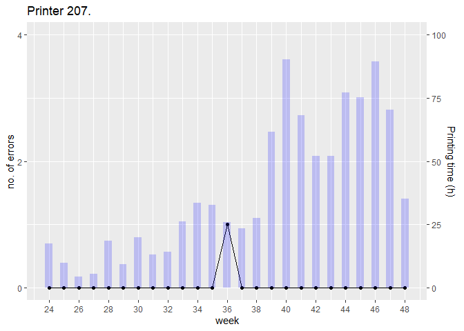

# Model Results

This markdown file provides the code required to:

1.  Understand how the model is sampled and used.
2.  Re-create graphs 1, 2 and 3 presented in the article.

The article’s complete JAGS model, sampled with all 8113 printer-weeks,
is stored in a model BUGS object
([model.RData](https://doi.org/10.5281/zenodo.10413762). This model is
loades and used in the current script. Tere is no need to run
01ModelExecution.Rmd script prior to this one.

## 1. Libraries

``` r
library(R2jags)
library(ggplot2)
library(dplyr)

# ploting libraries are stored in the utils file: 00_Utils.R

source('00_Utils.R')
```

## 2. Data loading

**data file**. For confidentiality reasons only data from the 4 printers
shown in the article are provided. They are printer 7, 116, 207 and 216.

**model file**. The model contains the posterior samples using all the
357 printers observations (8,113 printer-weeks in total). The model has
3 chains, each sampled 10,000 times after a 1,000 burn-in period.

``` r
load(file='data/data.RData')
load(file='model.RData')

nObs = dim(data)[1]
nMaq = length(unique(data$id))
totNumMaq = dim(model$BUGSoutput$sims.list$alpha)[2]
maq <- unique(data$id)

# color blindness pallette
cbp2 <- c("#000000", "#E69F00", "#56B4E9", "#009E73",
          "#F0E442", "#0072B2", "#D55E00", "#CC79A7")
```

## 3. Model Convergence Checking

### 3.1 Traceplots for model parameters.

All three MCMC sampling chains converge reasonably for the model
parameters.

<!-- -->

### 3.2 Traceplots for selected printer random effects parametres.

All three MCMC sampling chains converge for the printers’ random
effects.

``` r
toPlot <- data.frame(mcmc = rep(1:model$BUGSoutput$n.keep, times = model$BUGSoutput$n.chains * length(maq)),
                     printer = rep(maq, each = model$BUGSoutput$n.sims),
                     chain = as.factor(rep(1:3, each = model$BUGSoutput$n.keep, times = length(maq))),
                     alpha = t(rbind(model$BUGSoutput$sims.array[,,maq])))

ggplot(data = toPlot, aes(x = mcmc, y = alpha, color = chain)) +
  geom_line(alpha = 0.6) +
  labs(title = 'Random effects MCMC chains') +
  scale_fill_manual(values = cbp2[-1], aesthetics = c('color','fill')) +
  facet_wrap(~ printer)
```

<!-- -->

## 4 Model Results

### 4.1 Posterior Distributions

#### 4.1.1 Model Posterior Parameter Statistics

Mean, standard deviation, Q1, median and Q2 statistics from the model
parameters posterior distributions.

    ##               mean      sd    q2_5  median   q97_5
    ## intercept  -4.9489 -4.9489 -5.0947 -4.9486 -4.8048
    ## PVC         0.3146  0.3146  0.1418  0.3145  0.4893
    ## Jobs        0.2111  0.2111  0.1665  0.2110  0.2573
    ## var[alpha]  0.6138  0.0648  0.4992  0.6100  0.7507
    ## delta       1.8323  0.0391  1.7556  1.8321  1.9088
    ## pi          0.1523  0.0156  0.1227  0.1519  0.1842

#### 4.1.2 Delta Posterior Distribution

Posterior distribution of the out-of-control multiplier.

<!-- -->

#### 4.1.3 Random Effects Posterior Distribution

Printer random effects 95% credibility interval ordered by increasing
mean value.

``` r
# create a matrix with median ordered machines random effect so they can be plot.

val <- t(apply(model$BUGSoutput$sims.list$alpha,2, quantile, probs = c(0.025,0.5,0.975)))
colnames(val) <- c('li','median','ui')
valOrd = val[order(val[,2]),]

# plot machine random effects ordered from lower to higher

empty = 3
ggplot(data=data.frame(valOrd[c(seq(from = 1,to = totNumMaq, by = empty),totNumMaq),])) +
  geom_linerange(aes(x= c(seq(from = 1,to = totNumMaq,by = empty),totNumMaq) ,ymax = ui, ymin = li)) +
  geom_hline(yintercept=0,col='black',lty=2) +
  geom_point(aes(x= c(seq(from = 1,to = totNumMaq,by = empty),totNumMaq),y = median),size=0.2)+
  coord_flip() +
  labs(title = 'Printers random effect 95% credibility interval',y= expression(alpha),x='printers')+
  ylim(-3,3)
```

<!-- -->

### 4.2 Posterior Predictive Distributions

#### 4.2.1 Sampling

To sample from the posterior predictive one has to:

1.  Create the matrix **XY** with the printer id and week, response
    **y** (no. errors), priting time, **off**, and covariates **X1**,
    for the percentage time printing PVC and **x2**, average number of
    jobs per hour.

The actual row position in the original printer-week dataset,**rowId**
column, is included as it is necessary to access the right printer-weeks
from the JAGS model samples. The JAGS model file were sampled with the
whole observed dataset and not just the observations from the 4 printers
considered in this script.

``` r
XY = data[,c('id', 'week', 'nTotal', 'timeImHour', 'PVCsecPerc', 'jobsPerTime', 'rowId')]
colnames(XY)[3:ncol(XY)] = c('y','off','x1','x2','rowId')
```

2- estimate the expected rate value per simulation and machine-week when
the printer is in control:

``` math
\hat{E}[\theta_{jt}^{(s)}|\vec{x}_{jt}] = 
t_{jt} e^{\vec{x}_{jt}^T\vec{b}^{(s)}+a_j^{(s)}} 
```

3- estimate the machine-week outcome as the mean expected value (mean of
the rate):

``` math
\tilde{y}_{ij} = \frac{1}{S} \sum_{s=1}^S\hat{E}[\theta_{ij}^{(s)}|\vec{x}_{ij}] 
```

To speed the process the whole computation is done via matrix algebra
using the matrices defined below:

- $\mathbf{\tilde{Y}}$, a matrix with number of printer-weeks rows and
  number of simulated samples columns for the number of errors posterior
  predictive samples:

``` math
\mathbf{\tilde{Y}} = 
\begin{bmatrix}
\tilde{y}_1^{(1)} &\cdots  &  \tilde{y}_1^{(k)} & \cdots  & \tilde{y}_1^{(S)}  \\ 
\vdots &    &  \vdots &    &  \vdots \\
\tilde{y}_i^{(1)} & \cdots  &  \tilde{y}_i^{(k)}& \cdots  & \tilde{y}_i^{(S)} \\ 
\vdots &    &  \vdots &    &  \vdots \\
\tilde{y}_{N}^{(1)} & \cdots  &  \tilde{y}_{N}^{(k)}& \cdots  & \tilde{y}_{N}^{(S)} \\ 
\end{bmatrix}
```

- $\mathbf{X}$, matrix with dimension number of observations times the
  number of covariates (including intercept), where each covariate $x_i$
  is ordered respect its parameter estimate $b_i$:

$$
\mathbf{X} = 
\begin{bmatrix}
1 &  x_{11}&  x_{21}  \\ 
\vdots & \vdots  &  \vdots  \\
1 &  x_{1k}  &  x_{2k} \\ 
\vdots & \vdots  &  \vdots  \\
1 &  x_{1N}  &  x_{2N} \\ 
\end{bmatrix}
$$

- $\mathbf{B}$, a three fixed effects rows (including intercept) and
  number of simulated samples column matrix with *b0*, *b1* and *b3*
  parameter sampling:

$$
\mathbf{B} = \begin{bmatrix}
b_0^{(1)} &\cdots  &  b_0^{(k)} & \cdots  & b_0^{(S)}  \\ 
b_1^{(1)} & \cdots  &  b_1^{(k)}& \cdots  & b_1^{(S)} \\ 
b_{2}^{(1)} &\cdots   &  b_{2}^{(k)}& \cdots  & b_{2}^{(S)} 
\end{bmatrix}
$$

- $\mathbf{A}$, a number of observation rows times number of simulations
  column matrix for the random effects. Random effects are repeated the
  number of printer-weeks per printer to ease matrix computation:

$$
\mathbf{A} = \begin{bmatrix}
a_1^{(1)} &\cdots  &  a_1^{(k)} & \cdots  & a_1^{(S)}  \\ 
a_1^{(1)} & \cdots  &  a_1^{(k)}& \cdots  &  a_1^{(S)}\\ 
\vdots & \cdots  &  \vdots & \cdots  &  \vdots \\
a_i^{(1)} & \cdots  &  a_i^{(k)}& \cdots  & a_i^{(S)} \\ 
a_i^{(1)} & \cdots  &  a_i^{(k)}& \cdots  & a_i^{(S)} \\ 
\vdots & \cdots  &  \vdots & \cdots  &  \vdots \\
a_M^{(1)} & \cdots  &  a_M^{(k)}& \cdots  & a_M^{(S)} \\ 
a_M^{(1)} &\cdots   &  a_M^{(k)}& \cdots  & a_M^{(S)} 
\end{bmatrix}
$$

With the above definitions:

$$
\mathbf{\tilde {Y}} \sim Pois(\mathbf{O} \times e^{\mathbf{X} \times \mathbf{B} + \mathbf{A}})
$$

where $\mathbf{O}$ is the printing time vector.

``` r
## Building the model to estimate theta_jt

X = matrix(c(rep(1,nObs),
             sapply(5:6,function(i) XY[,i])), 
             nrow = nObs)
B = t(model$BUGSoutput$sims.matrix[,c('b0','b1','b2')])
A = t(model$BUGSoutput$sims.list$alpha[,XY$id])

# to multiply first row of matrix by first element of a vector, second row by second element, etc. one
# can directly multiply the matrix by the vector as vector is recycled and product is done by columns
# Z <- matrix(1:4, nrow = 2, byrow = T)
# d <- c(1,2)
# Z*D

d <- c(model$BUGSoutput$sims.list$delta)
Z <- model$BUGSoutput$sims.list$z[,XY$rowId]

# estimate expected value posterior per simulated sample

thetaPost = exp(X %*% B + A ) * XY$off  #%*% is matrix product and * is Hadamard product

# compute posterior statistics for each printer-week 

XY$meanThetaPost = apply(thetaPost,1,mean)
XY$QmaxThetaPost = apply(thetaPost,1,quantile,probs=0.975)
XY$QminThetaPost = apply(thetaPost,1,quantile,probs=0.025)

## Simulate from the posterior predictive

set.seed(1964)
yPred = matrix(rpois(n=length(thetaPost),lambda=thetaPost), nrow=nObs)

# compute posterior predictive quartiles for each printer-week

XY$QmaxYPred = apply(yPred,1,quantile,probs=0.975)
XY$QminYPred = apply(yPred,1,quantile,probs=0.025)

## Identify outliers

XY$z <- model$BUGSoutput$mean$z[XY$rowId]

rm(A,B,d)
```

### 4.3 Posterior Predictive Charts

The enhanced control charts with posterior and posterior predictive
information correspond to figure 3 in the article. The x-axis indicates
the study week. The black points and solid lines represent the number of
error messages observed in each week (left y-axis). The dashed black
line indicates the estimated number of errors per week when in-control.
The gray ribbon provides the 95% posterior predictive credibility
interval for the number of errors when in-control. The light red columns
plot the probability that the model assigns tothe printer working in an
out-of-control situation in any given week (right y-axis). The circles
indicate the printer–weeks the model identifies as deriving from an
out-of-control state.

``` r
plotFull(id = 7, obs = XY, y1Lim = 4, y2Lim = 1)
```

<!-- -->

``` r
plotFull(id = 116, obs = XY, y1Lim = 4, y2Lim = 1)
```

<!-- -->

``` r
plotFull(id = 207, obs = XY, y1Lim = 4, y2Lim = 1)
```

<!-- -->

``` r
plotFull(id = 216, obs = XY, y1Lim = 4, y2Lim = 1)
```

<!-- -->

### 4.4 Raw charts

Raw printers control charts (figure 1 in the article). The x-axis
indicates the study weeks. The black dots and lines plot the number of
error messages in each week (left y-axis) and the blue bars the printing
hours in each week (right y-axis).

``` r
plot0(id = 7, obs = XY, y1Lim = 4, y2Lim = 100)
```

<!-- -->

``` r
plot0(id = 116, obs = XY, y1Lim = 4, y2Lim = 100)
```

<!-- -->

``` r
plot0(id = 207, obs = XY, y1Lim = 4, y2Lim = 100)
```

<!-- -->

``` r
plot0(id = 216, obs = XY, y1Lim = 4, y2Lim = 100)
```

<!-- -->
