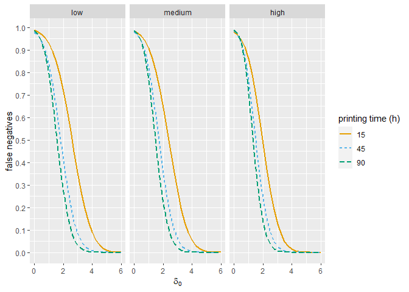

# OC Curves Construction

This script constructs the OC curves using different print times and
deltas and the three types of printer usage (low, medium and high). It
loads the results from the performance scenario simulation stored at
data/results.RData, computes the required metrics for the OC curves and
plots them.

## 1. Library loading

``` r
library(ggplot2)
library(dplyr)

# color blindness pallette
cbp2 <- c("#000000", "#E69F00", "#56B4E9", "#009E73",
          "#F0E442", "#0072B2", "#D55E00", "#CC79A7")
```

## 2. Data loading

Loads the performancResults dataframe from the model performance
simulation (03_ModelPerformance.Rmd). Each row in the dataframe is a
combination of scenario (9 available) and delta value (from 0 to 6 in
steps of 0.25). It includes:

1.  **scenario**, scenario number, from 1 to 9 as three different usage
    conditions are combined with three different print times.
2.  **delta**, out of control multiplier used in the current simulation.
3.  **tp**, true positives observed in the simulation.
4.  **fn**, false negatives observed in the simulation. The sum of true
    positives and false negatives gives the total 1,785,000
    printer-weeks sampled per simulation (357 printers, 5,000 times
    each).
5.  **type**, scenario usage conditions. It is a combination of PVC
    printed and jobs per hour done. It has three levels: low (0% PVC and
    1 job every 2 hours), medium (50% PVC and 1 job change per hour) and
    high (100% PVC and 3 job changes per hour).
6.  **timeImHour**, total weekly printing time.
7.  **PVCsecPerc**, total percent time spent printing on PVC on this
    week.
8.  **jobsPerTime**, average number of jobs per printing hour.

``` r
# results dataframe from the 03_ModelPerformance.Rmd script

load(file = 'data/results.RData')
```

## 3. OC curves generation

In order to plot the OC curves the script computes the beta value (false
negatives).

``` r
# compute required intermediat values

N <- results$fn[1]+results$tp[1]
results$beta <- results$fn/N
results$power <- 1-results$beta

# Plot results

ggplot(results, aes(x = delta, y = beta, col = as.factor(timeImHour), lty = as.factor(timeImHour)))+
  geom_line(linewidth = 1) +
  facet_grid( ~ type) +
  scale_y_continuous(breaks = seq(0,1,0.1)) +
  labs(color = 'printing time (h)', linetype = 'printing time (h)', y = 'false negatives', x = expression(paste(delta[0]))) +
  scale_fill_manual(values = cbp2[-1], aesthetics = c('color','fill')) 
```

<!-- -->

``` r
# error type I estimation

delta0 <- results[results$delta == 0,]
colnames(delta0)[9:10] <- c('1-alpha','alpha')

delta0$alpha <- delta0$alpha*100
delta0$type <- ordered(delta0$type, levels = c('low','medium','high'))

delta0[, c('scenario','delta','alpha','type','timeImHour','PVCsecPerc','jobsPerTime')]
```

    ##     scenario delta    alpha   type timeImHour PVCsecPerc jobsPerTime
    ## 1          1     0 1.228739    low         15        0.0         0.5
    ## 26         2     0 2.155126    low         45        0.0         0.5
    ## 51         3     0 1.557871    low         90        0.0         0.5
    ## 76         4     0 1.539328 medium         15        0.5         1.0
    ## 101        5     0 1.955014 medium         45        0.5         1.0
    ## 126        6     0 1.401793 medium         90        0.5         1.0
    ## 151        7     0 1.997983   high         15        1.0         3.0
    ## 176        8     0 1.527731   high         45        1.0         3.0
    ## 201        9     0 1.096527   high         90        1.0         3.0
